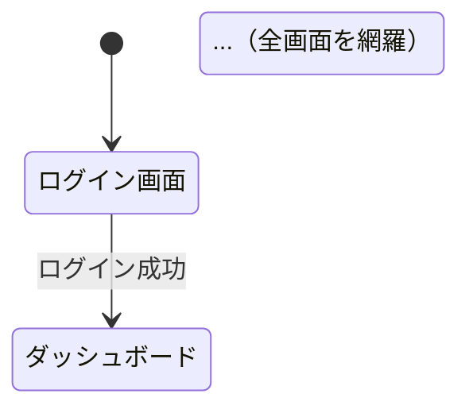

# /project:manual

システムの完全マニュアルを自動生成します。
全画面・全機能・全APIを網羅した「これを読めばシステムの全てがわかる」ドキュメントです。
各画面の詳細設計レベルの仕様を含みます。

## 引数

$ARGUMENTS をスペース区切りで以下のように解釈してください：
- 第1引数: 対象パス
- 第2引数: システム名（ファイル名に使用）

```
例: /project:manual ./src user-management-system
例: /project:manual /Users/.../my-project my-app
```

以降、第1引数を「対象パス」、第2引数を「システム名」として参照します。

## 実行内容

対象パスのコードを**すべて**読み込み、以下の構成で完全マニュアルを生成してください。
省略は不可。全機能・全画面・全APIを網羅すること。

---

### Step 0: ファクト収集（文章を書く前に必ず実行）

**ファクトキャッシュ**:
ファクト収集の前に `python3 scripts/cache_analysis.py --action check-facts --source-dir {対象パス} --name {名前}` を実行。
キャッシュが有効な場合は `.cache/facts-{名前}.yaml` から読み込んでファクト収集をスキップし、
「キャッシュ済みファクトを使用（{生成日時}、コミット {hash}）」と表示する。
キャッシュが無効（ソース変更あり）または存在しない場合は通常通りファクト収集を実行し、
完了後に `python3 scripts/cache_analysis.py --action save-facts --source-dir {対象パス} --name {名前}` でキャッシュに保存する。

`templates/thinking-frameworks.md` の選択マトリクスと `templates/business-context.md` の自動収集チェックリストを参照し、
ファクト収集と同時にシステム特性の把握・ビジネスコンテキストの収集・フレームワークの選択を1パスで実施する。
ファクトの構造は `templates/fact-schema.yaml` を参照。

**追加収集項目**（既存の facts YAML に以下を追加）:

```yaml
  system_profile:
    scale: small|medium|large      # 画面数・テーブル数・API数から判定
    domain: "(業務系/EC系/管理系/API特化)"
    complexity: simple|moderate|complex
  business_context:
    purpose: "(1-2文でシステムの存在理由)"
    users: [{role: "...", needs: "..."}]
    confidence: low|medium|high
  selected_frameworks:  # thinking-frameworks.md のセクション3から自動選択
    - name: "MECE"
    - name: "So What? / Why So?"
```

対象パスのコードを読み、以下のカテゴリごとに発見した事実を構造化データとして整理してください。
このデータを **文章化の唯一の入力** として使用します。ファクト収集で列挙されていない事実を本文に書くことは禁止です。

**出力**: 以下の YAML 構造でファクトを整理する（最終出力ファイルには含めず、作業用中間データとして使用）

````yaml
facts:
  routes:       # 全ルーティング定義
    - method: (HTTP メソッド)
      path: (パス)
      controller: (コントローラー#メソッド)
      source: "(ファイル:行番号)"
  controllers:  # 全コントローラー
    - name: (クラス名)
      file: (ファイルパス)
      methods: [...]
      source: "(ファイル:行番号)"
  models:       # 全モデル
    - name: (クラス名)
      table: (テーブル名)
      file: (ファイルパス)
      source: "(ファイル:行番号)"
  tables:       # 全テーブル（マイグレーション or DB分析から）
    - name: (テーブル名)
      type: (master/transaction/relation/system)
      columns: [{name: ..., type: ...}]
      source: "(ファイル:行番号)"
  screens:      # 全画面
    - name: (画面名)
      path: (URL パス)
      component: (コンポーネントファイル)
      elements: {buttons: [...], forms: [...], tables: [...]}
      source: "(ファイル:行番号)"
  stores:       # 状態管理
    - name: (Store名)
      file: (ファイルパス)
      actions: [...]
      source: "(ファイル:行番号)"
  middleware:   # ミドルウェア
    - name: (名前)
      file: (ファイルパス)
      source: "(ファイル:行番号)"
  services:     # サービス層
    - name: (クラス名)
      file: (ファイルパス)
      methods: [...]
      source: "(ファイル:行番号)"
````

**ルール**:
1. 各エントリの `source` は必須。ファイルパスと行番号を `file:line` 形式で記録
2. コードを実際に読んで確認した事実のみ記録。推測は `confirmed: false` を付与
3. ファクト収集完了後、件数を確認: routes件数 = API一覧件数、screens件数 = 画面一覧件数
4. ファクト収集が完了してから、以降のセクション（共通ルール以降）の文章化に進む
5. **モジュール有効性チェック（必須）**: `quality-rules.md` §4a に従い各モジュールの active を判定する。コードの存在だけでモジュールを列挙しない

---

### Step 0b: ストーリーライン設計

`templates/storyline-design.md` を参照し、ファクト収集の結果を基にドキュメント全体のストーリーラインを設計する。

1. **メインメッセージ**: このドキュメント全体で読者に伝えたい結論を1-2文で定義
2. **各セクションのサブメッセージ**: 章/セクションごとの結論を1文ずつ定義
3. **ピラミッド構造**: 結論先行 → 根拠（ファクトから） → 詳細

テンプレート埋めに入る前にストーリーラインを確定させること。メッセージが定まらないまま書き始めない。

---

### Step 0c: 重要度マッピング

`templates/priority-analysis.md` を参照し、Step 0 のファクトとビジネスコンテキストに基づいて全機能を Tier 1（コア）/ Tier 2（重要）/ Tier 3（補助）に分類する。
Tier 1 は全機能の 20-30% を目安とする。Tier 1 の機能はビジネスルール詳細・エッジケース・パフォーマンス考慮点まで深掘りし、Tier 3 は第3章で概要+API一覧に留める。ただし第6章（画面詳細設計）は全画面必須のため Tier に関係なくフォーム仕様・テーブル仕様は省略しない。
Tier分類の対象は active: true のモジュールのみ。disabled_modules は §11 に無効化モジュール一覧として記載する（`quality-rules.md` §4a 参照）。

---

### ⚠️ 共通ルール（最優先）

`templates/quality-rules.md` の全ルールに従うこと。ソース引用は `(file:line)` 形式（本文に表示）。
以下は本コマンド固有の追加ルール：

1. 各セクションは独立して読めるように書く
2. 画面レイアウト図もテンプレートのDOM構造から復元する
3. Mermaid図は1ファイル1図とする（複数図を `---` で結合しない）
4. **全機能に同じテンプレートを適用する**（前半だけ詳しく後半が薄くなることは許容しない）
5. **DB分析結果がある場合（`.cache/db-*.json` が存在する場合）:**
    - 第5章（データモデル）: DBスキーマ情報を読み込み、マイグレーションだけでなく実DBの状態を反映する
    - 第5章: マスタテーブルの有効/無効レコード数を記載（例:「商品カテゴリ: 有効 12件 / 無効 3件」）
    - 第5章: 設定テーブルの主要な設定値を記載
    - 第3章（機能カタログ）: 機能フラグで無効化されている機能は【機能OFF】と注記
    - 第3章: マスタデータで無効化されたレコードに依存する機能は【DB無効】と注記
    - 第6章（画面詳細設計）: フォーム仕様のフィールド名はDB上のラベル/表示名がある場合それを優先
    - 第6章: テーブル仕様のカラム表示名もDB上のラベルを反映
    - 第8章（設計評価）: コード⇔DB間の不整合のサマリーを記載し、詳細は第9章を参照
    - 第9章（コード⇔DB突合レポート）: DB分析結果の全詳細をこの章に集約
6. **⚠️ 最重要: Mermaid図は必ず `--- FILE: docs/diagrams/... .mmd ---` として個別ファイルに出力すること。**
   - Markdown内にインラインで書いた図も、必ず対応する .mmd ファイルを出力形式セクションに含める
   - インライン図だけで .mmd ファイルを出力しないのは**ルール違反**
   - 第3章の各機能のシーケンス図、第5章のER図、第7章のウォークスルー図も全て個別 .mmd として出力
7. **画面詳細設計（第6章）は全画面を網羅すること。** 第2章の画面一覧に載っている全画面に対して詳細設計を記述する。一部の画面だけ記載して残りを省略することは許容しない
8. コンポーネント名は「MasterControllers」のような集約表記を使わない。全て個別に列挙する
9. **全ドキュメントの先頭にヘッダー情報を含める:**
    ```
    > 生成日: {今日の日付} | 対象: {対象パス} | ステータス: DRAFT | ツール: knowledge-asset-tool
    ```
10. **ページ内アンカーリンク目次は含めない**（MkDocs Material の右サイドバーが見出しから自動生成するため二重になる。ただし別ファイルへのリンク集（03-features.md の機能リンク等）は含める）
11. **ドキュメント間の相互リンク:** 同じ情報を複数箇所に書かず、詳細は1箇所にまとめて他からリンク参照する。例: ロール一覧は04-api-reference.mdに集約し、他の章では「詳細は[第4章 ロール一覧](04-api-reference.md#4-2-認証認可)を参照」とリンク
12. **図リンク必須:** 各章で対応するMermaid図（SVG）がある場合、章の冒頭に `` を必ず含める。対応ルール:
    - 第1章 → `{name}-architecture.svg`
    - 第2章 → `{name}-screen-flow.svg`
    - 第5章 → `{name}-er-*.svg`, `{name}-data-flow.svg`
    - 第7章 → `{name}-seq-*.svg`
13. **SVG図の埋め込みリンク:** SVG図を埋め込む際は、直下に別ウィンドウリンクも付ける:
    ```
    
    <a href="../../diagrams/{システム名}-screen-flow.svg" target="_blank">🔍 画面遷移図を別ウィンドウで開く</a>
    ```
14. **CRUD共通パターンの簡略化:** 標準的なCRUD（一覧取得・詳細取得・作成・更新・削除）のシーケンス図は、第3章の最初に「共通CRUDパターン」として1回だけ示す。個別機能では共通パターンとの差分のみ記述し、差分がない場合は「共通CRUDパターンと同一」と明記する
15. **検収成果物モードの節番号**: 検収成果物モード（Step 1 質問5で有効化）の場合、章節番号を「1.1 / 1.1.1」形式に変更する。
    - 「第1章：システム概要」→「1. システム概要」
    - 「1-1. 一言説明」→「1.1 一言説明」
    - 「3-N. {機能名}」→「3.N {機能名}」
    検収成果物モードでない場合は現在の「第N章 / N-N」形式を維持する。

---

### 第1章：システム概要

#### 1-1. 一言説明
システムの目的を1文で。

#### 1-2. 解決する課題
- このシステムがなかった場合の問題
- このシステムで解決されること

#### 1-3. 技術スタック

| カテゴリ | 技術 | バージョン | 用途 |
|---------|------|-----------|------|

バージョンが不明な場合は「要確認」と記載する（空欄や `-` にしない）。

#### 1-4. アーキテクチャ概要図
```mermaid
flowchart TD
```

#### 1-5. ディレクトリ構成
主要ディレクトリの役割を表で整理。

---

### 第2章：画面遷移図

#### 2-1. 全体画面遷移図

コードベースのルーティング定義（routes, pages, router等）を分析し、
全画面の遷移を stateDiagram で網羅的に描いてください。

画面間の遷移は以下を全て含めること：
- サイドバー・ナビゲーションからの直接遷移
- ボタン・リンクによる画面間遷移
- 認証状態による遷移（ログイン前/後）
- エラー時の遷移（認証切れ→ログイン画面等）



#### 2-2. 画面一覧表

| # | 画面名 | パス/URL | 認証要否 | ロール制限 | 主な機能 |
|---|--------|---------|---------|-----------|---------|

全画面を漏れなくリストアップすること。

---

### 第3章：機能カタログ

全機能を1機能1セクションで記述してください。
**⚠️ 全ての機能に以下のテンプレートを漏れなく適用すること。前半だけ詳しく後半が薄くなることは許容しない。**

各機能セクションのテンプレート（全項目必須）：

#### 3-N. {機能名}

**概要**: 何ができるか（ユーザー視点・2-3行）

**画面**: 対応する画面名・パス

**操作フロー**:
```mermaid
sequenceDiagram
```
（ユーザーの操作からシステムの応答までを図示。全機能に必須。）

**関連コンポーネント**:

| レイヤー | コンポーネント | ファイル | 責務 |
|---------|--------------|---------|------|
| Controller | ... | ... | ... |
| Repository | ... | ... | ... |
| Model | ... | ... | ... |
| Trait/Util | ... | ... | ... |
| Store(FE) | ... | ... | ... |

全機能にこの表を必ず含めること。該当なしの場合は「該当なし」と明記。

**APIエンドポイント**:

| メソッド | パス | 説明 | リクエスト主要パラメータ | レスポンス概要 |
|---------|------|------|----------------------|--------------|

省略形（「CRUD 5件」等）は禁止。全エンドポイントを個別に列挙すること。

**ビジネスルール**:
- この機能固有の計算ロジック、条件分岐、バリデーション
- 条件が3つ以上の複合条件がある場合はデシジョンテーブル形式で記述する:

| 条件A | 条件B | 条件C | 処理 |
|-------|-------|-------|------|
| Y | Y | * | 処理X |
| Y | N | Y | 処理Y |

- ステータス遷移がある場合は遷移表で記述する:

| 現在ステータス | 操作 | 遷移先 | 許可ロール | ソース |
|-------------|------|--------|----------|--------|

- 該当なしの場合は「特になし」と明記

**注意点**:
- 落とし穴、既知の問題、Typo、workaround
- 該当なしの場合は「特になし」と明記

---

### 第4章：API リファレンス

#### 4-1. API一覧

全APIエンドポイントを網羅的にリストアップ。
**省略形（「19-23 CRUD /api/cars」等）は禁止。1行1エンドポイントで全件列挙。**

| # | メソッド | パス | 認証 | 説明 | Controller#method |
|---|---------|------|------|------|------------------|

**エンドポイント別エラー定義（Tier 1機能のみ）:**

各Tier 1機能のエンドポイントに対して、以下のエラーテーブルを含める:

| HTTPステータス | エラーコード | 条件 | レスポンス例 | ソース |
|---------------|-----------|------|-----------|--------|
| 401 | UNAUTHENTICATED | トークン未送信/無効 | {"error": "..."} | (Middleware:xx) |
| 403 | FORBIDDEN | ロール権限不足 | {"error": "..."} | (AccessMiddleware:xx) |
| 422 | VALIDATION_ERROR | バリデーション失敗 | {"errors": {...}} | (FormRequest:xx) |

#### 4-2. 認証・認可

- 認証方式の説明
- トークンのライフサイクル
- ロール・権限の一覧と各ロールのアクセス範囲

#### 4-3. 共通レスポンス形式

- 正常時のレスポンス構造（JSON例付き）
- エラー時のレスポンス構造（JSON例付き）
- HTTPステータスコードの使い分け

#### 4-4. レート制限・セキュリティ

- レート制限の有無と設定
- CORS設定
- CSRF保護
- その他のセキュリティ対策

#### 4-5. OpenAPI 定義（YAML）

第4章の全エンドポイントを **OpenAPI 3.x 仕様** の YAML 形式でも出力してください。
これにより Swagger UI 等のツールでAPI仕様を閲覧・テストできます。

```yaml
openapi: "3.0.3"
info:
  title: {システム名} API
  version: "1.0.0"
paths:
  /api/example:
    get:
      summary: ...
      parameters: [...]
      responses:
        "200":
          description: ...
```

全エンドポイントを含めること。リクエストパラメータ・レスポンススキーマは
コードから推測できる範囲で記述し、不明な部分は `description: "要確認"` とする。

---

### 第5章：データモデル

#### 5-1. テーブル一覧

**全テーブルを漏れなくリストアップすること。「その他 N件」のような省略は禁止。**

| # | テーブル名 | 種別(M/T/R/S) | 説明 | 全カラム（型・NULL・制約） |
|---|-----------|--------------|------|------------------------|

カラムにはデータ型も記載すること（例: `name(varchar)`, `amount(decimal)`, `is_active(boolean)`）。

#### 5-2. データディクショナリ

全テーブル（テーブル数が50以上の場合は主要テーブル15件以上のデータディクショナリ + 残りは5-1のカラム一覧で網羅）について、カラムレベルの詳細仕様を記述してください。

各テーブルのテンプレート：

**テーブル名: {テーブル名}**

| # | カラム名 | データ型 | NULL許可 | デフォルト | 説明 | 制約・備考 |
|---|---------|---------|---------|----------|------|-----------|

制約・備考の例: PK, FK(参照先テーブル), UNIQUE, INDEX, ENUM値一覧

#### 5-3. ER図（Crow's Foot記法）

主要なリレーションを中心にER図を作成。
テーブル数が多い場合は以下のようにドメインごとに分割：
- 売上・配送系ER図
- 請求・経費系ER図
- マスタ系ER図

各ER図は個別の `.mmd` ファイルとして出力。

```mermaid
erDiagram
```

#### 5-4. データフロー
どのデータがどこから来て、どこに流れるかを図示。

---

### 第6章：画面詳細設計

**⚠️ このセクションが最も重要。全画面の詳細設計レベルの仕様を記述する。**

全画面を1画面1セクションで記述してください。
以下のテンプレートを全画面に同じ深さで適用すること。

#### 6-N. {画面名} 詳細設計

**基本情報**:

| 項目 | 内容 |
|------|------|
| 画面名 | |
| パス/URL | |
| 認証要否 | |
| ロール制限 | |
| 対応Pageコンポーネント | ファイルパス |
| 対応Storeモジュール | ファイルパス |

**画面構成要素**:

| # | 要素名 | 種別 | 説明 | バインド先 |
|---|--------|------|------|-----------|

種別: テーブル / フォーム / ボタン / モーダル / グラフ / タブ / フィルター / ページネーション 等

**画面レイアウト**（テキストで構成を説明）:
```
┌─────────────────────────────────────┐
│ ヘッダー（ナビゲーション・ユーザー名）    │
├───────┬─────────────────────────────┤
│       │ フィルター（年月・期間選択）       │
│サイド  ├─────────────────────────────┤
│バー    │ メインコンテンツ                │
│       │  ├─ サマリーカード群             │
│       │  ├─ データテーブル              │
│       │  └─ グラフエリア               │
├───────┴─────────────────────────────┤
│ フッター                              │
└─────────────────────────────────────┘
```
（画面ごとにレイアウトを記述。上記は例。）

**初期表示時の処理フロー**:
```mermaid
sequenceDiagram
```
（画面マウント時のAPI呼び出し → データ取得 → 表示までのフロー）

**ユーザー操作一覧**:

| # | 操作 | トリガー | 処理内容 | API呼び出し | 結果 |
|---|------|---------|---------|------------|------|

（この画面で行える全ての操作を列挙）

**フォーム仕様**:

画面にフォーム入力・編集可能なフィールド・検索フィルター等がある場合は必ず記載すること。
「該当なし」の場合のみ省略可。ユーザー操作一覧に「登録」「編集」「追加」「検索」「フィルター」等の操作がある場合、対応するフォーム仕様は必須。

| # | フィールド名 | 型 | 必須 | バリデーション | 初期値 |
|---|------------|------|------|-------------|--------|

**テーブル仕様**:

画面にデータ一覧表示・テーブル・リスト等がある場合は必ず記載すること。
「該当なし」の場合のみ省略可。画面構成要素に「テーブル」「一覧」「リスト」等がある場合、対応するテーブル仕様は必須。

| # | カラム名 | 表示名 | ソート | フィルター | 書式 |
|---|---------|--------|-------|-----------|------|

**状態管理**:
- 使用する状態管理モジュール（Vuex / Pinia / Redux / Zustand 等、該当するものを記載）
- 主要な state / getters / actions（フレームワークに合わせて記述）

**エラーハンドリング**:
| エラー種別 | 条件 | 表示 | 復帰方法 |
|-----------|------|------|---------|

**この画面から遷移できる画面**:
| 遷移先 | トリガー | 条件 |
|--------|---------|------|

---

### 第7章：ユースケース別ウォークスルー

代表的なユースケースを**5〜8個**選び、ユーザーの操作を起点にして
「画面A → 操作 → 画面B → ... → 完了」の流れを詳細に追跡。

**⚠️ 全ウォークスルーに Mermaid シーケンス図を必須とする。テキストのみのウォークスルーは禁止。**

各ウォークスルーに含める内容：
1. ユーザーの目的（何がしたいか）
2. 前提条件（ログイン済み、データが存在する等）
3. 操作ステップ（画面ごとに何をするか）
4. シーケンス図（API呼び出し、計算、DB更新を含む）
5. 正常完了時の結果
6. エラー時の動作と復帰方法

---

### 第8章：設計評価・改善案

#### 8-1. 良い点
#### 8-2. 問題点（深刻度付き）

セキュリティ観点も含めること：
- CSRF保護の状況
- 入力サニタイズの状況
- SQLインジェクション対策
- 認証・認可の堅牢性

#### 8-3. 改善案（優先順位・工数付き）

---

### 第9章：コード⇔DB突合レポート

**⚠️ この章はDB分析結果がある場合（`.cache/db-*.json` が存在する場合）のみ生成する。DB分析なしの場合はこの章を丸ごとスキップすること。**

DB分析結果とコード分析結果を突合し、「コードだけでは分からない」実態を可視化するレポート。

#### 9-1. 突合サマリー

分析の全体像を1段落で説明。

```
DB分析対象: {DB名} ({種別})
テーブル数: {N} (マスタ: {N} / トランザクション: {N} / リレーション: {N} / システム: {N})
有効/無効フラグ付きテーブル: {N}
設定テーブル: {N}
```

#### 9-2. マスタデータ有効/無効サマリー

有効/無効フラグを持つテーブルについて、レコードの状態を一覧化する。

| # | テーブル | フラグカラム | 有効件数 | 無効件数 | 無効レコード例 | コード参照箇所 |
|---|---------|------------|---------|---------|--------------|--------------|

**注意喚起**: 無効データを参照しているコードがあれば、行ごとに⚠️を付与し、影響範囲を記載。

#### 9-3. 機能フラグ・設定値レポート

設定テーブル（`settings`, `feature_flags` 等）の主要な設定値を一覧化する。

| # | テーブル | キー | 値 | コード上の参照 | 影響 |
|---|---------|------|-----|--------------|------|

特に以下に注目して記載すること：
- `false` / `0` / `off` に設定されている機能フラグ → その機能が実質無効であることを明記
- コード上に参照があるが設定値が存在しないキー → デフォルト値で動作していることを注記

#### 9-4. 表示名・ラベルマッピング

DBに格納されている表示名・ラベルとコード上の変数名・定数名の対応を一覧化する。

| # | テーブル | カラム | DB上のラベル例 | コード上の変数名 | 画面表示時の名称 |
|---|---------|--------|-------------|----------------|----------------|

この情報は画面詳細設計（第6章）やAPI仕様（第4章）でのフィールド名と実際の表示名の乖離を把握するのに有用。

#### 9-5. コード⇔DB不整合一覧

コード分析とDB分析の突合で検出された不整合をすべて列挙する。

| # | 種別 | 対象 | コード側 | DB側 | 深刻度 | 推奨アクション |
|---|------|------|---------|------|--------|--------------|

**種別の分類:**
- **未使用テーブル**: DBに存在するがコードから参照されていないテーブル
- **未定義テーブル**: コードが参照しているがDBに存在しないテーブル
- **カラム不整合**: コードが参照するカラムがDBに存在しない、またはその逆
- **型不整合**: コードの型とDBのカラム型が一致しない
- **マイグレーション乖離**: マイグレーションファイルとDBの実状態が異なる（ライブDB接続時のみ）

**深刻度:**
- 🔴 高: データ損失やエラーの可能性がある
- 🟡 中: 機能の不整合や予期しない動作の可能性
- 🟢 低: 不要なコード/テーブルの残存（整理推奨）

---

### セルフレビュー（出力前に必ず実行）

`templates/quality-rules.md` §5 のセルフレビューチェックリストを実行すること。
以下は本コマンド固有の追加チェック：

1. **章間整合**: 第2章の画面一覧件数 = 第6章の画面詳細設計件数、第4章のAPI件数 = routes件数、第5章のテーブル件数 = tables件数
2. **文書横断の数値整合**: 以下の数値が全文書で一致しているか確認:
    - ロール数（第1章 vs 第4章 vs 営業向け説明 vs architecture文書）
    - テーブル数（第5章 vs ADR vs architecture文書）
    - API数（第4章 vs architecture文書）
    - 画面数（第2章 vs 第6章 vs features/*.md の総数）
    不一致があれば、ソース（config/constants.php のロール定義、DB分析結果のテーブル数等）を正として統一する
3. **ソースコード由来のtypo**: コード上の識別子にタイポがある場合（例: `recieve`, `Seting` 等）、そのまま記載し初出時に「（原文ママ）」を付記する

---

## 出力形式

以下の形式で出力してください。「{システム名}」は第2引数の値に置き換えてください。

```
--- FILE: docs/manual/{システム名}/00-index.md ---
（目次。各章へのリンク）
（検収成果物モードの場合、先頭に templates/cover-page.md の内容を挿入する。
  DOC_ID は {prefix}-DD-001 形式で自動採番。VERSION は 1.0。
  STATUS は DRAFT。改訂履歴の初版エントリを自動挿入。）

--- FILE: docs/manual/{システム名}/01-overview.md ---
（第1章：システム概要）

--- FILE: docs/manual/{システム名}/02-screen-flow.md ---
（第2章：画面遷移図）

--- FILE: docs/manual/{システム名}/03-features.md ---
（第3章：機能カタログの目次 + 共通CRUDパターン説明。先頭に全機能へのリンク一覧を含む）

--- FILE: docs/manual/{システム名}/features/{機能名1}.md ---
--- FILE: docs/manual/{システム名}/features/{機能名2}.md ---
（第3章の各機能を1機能1ファイルで出力。例: features/login.md, features/billing.md）
（全機能分のファイルを作成すること。）

--- FILE: docs/manual/{システム名}/04-api-reference.md ---
（第4章：APIリファレンス）

--- FILE: docs/manual/{システム名}/openapi.yaml ---
（第4章 §4-5: OpenAPI 3.x 定義ファイル）

--- FILE: docs/manual/{システム名}/05-data-model.md ---
（第5章：データモデル + データディクショナリ）

--- FILE: docs/manual/{システム名}/06-screen-specs.md ---
（第6章：画面詳細設計 — 全画面の詳細仕様）

--- FILE: docs/manual/{システム名}/07-walkthrough.md ---
（第7章：ユースケース別ウォークスルー）

--- FILE: docs/manual/{システム名}/08-review.md ---
（第8章：設計評価・改善案）

--- FILE: docs/manual/{システム名}/db-reconciliation.md ---
（コード⇔DB突合レポート — DB分析ありの場合のみ生成。番号なしファイル名で条件付き出力）

--- FILE: docs/diagrams/{システム名}-architecture.mmd ---
（第1章のアーキテクチャ概要図 — 1ファイル1図）

--- FILE: docs/diagrams/{システム名}-screen-flow.mmd ---
（第2章の画面遷移図 Mermaid ソース — 1ファイル1図）

--- FILE: docs/diagrams/{システム名}-data-flow.mmd ---
（第5章のデータフロー Mermaid ソース — 1ファイル1図）

--- FILE: docs/diagrams/{システム名}-er-{ドメイン1}.mmd ---
--- FILE: docs/diagrams/{システム名}-er-{ドメイン2}.mmd ---
（以降、ドメインの数だけ作成。名前はシステムに合わせる。例: -er-users.mmd, -er-orders.mmd）

--- FILE: docs/diagrams/{システム名}-feat-{機能名1}.mmd ---
--- FILE: docs/diagrams/{システム名}-feat-{機能名2}.mmd ---
（第3章の各機能のシーケンス図。全機能分作成。例: -feat-login.mmd, -feat-billing.mmd）

--- FILE: docs/diagrams/{システム名}-seq-{ユースケース1}.mmd ---
--- FILE: docs/diagrams/{システム名}-seq-{ユースケース2}.mmd ---
（第7章の各ウォークスルーのシーケンス図。ウォークスルーの数だけ作成）

⚠️ 重要: 上記の .mmd ファイルは省略不可。
第3章のインライン図 → -feat-*.mmd として出力
第5章のインラインER図 → -er-*.mmd として出力
第7章のインライン図 → -seq-*.mmd として出力
全てのインラインMermaid図に対応する .mmd ファイルを必ず出力すること。
```

出力後、以下を案内してください：
```
完全マニュアル生成完了！

  章構成:
    00 目次
    01 システム概要
    02 画面遷移図（全N画面）
    03 機能カタログ（全N機能）
    04 APIリファレンス（全N件）
    05 データモデル（全Nテーブル）
    06 画面詳細設計（全N画面の詳細仕様）
    07 ウォークスルー（N本）
    08 設計評価・改善案
    09 コード⇔DB突合レポート（DB分析ありの場合のみ）

  次のコマンドでファイルに保存できます：
  python scripts/save_output.py \
    --name {システム名} \
    --output-dir ./docs

  生成内容の実在性を検証するには：
  python scripts/verify_docs.py \
    --docs-dir ./docs \
    --source-dir {対象パス} \
    --name {システム名}

  Mermaid図をSVGに変換してブラウザで閲覧可能にするには：
  python scripts/convert_diagrams.py --docs-dir ./docs
```

### 次のステップ

- エンドユーザー操作ガイドを生成するには: `/project:user-guide {対象パス} {システム名}`
- マニュアルベースのスライドを作成するには: `/project:manual-slide docs/manual/{システム名} {システム名}`
